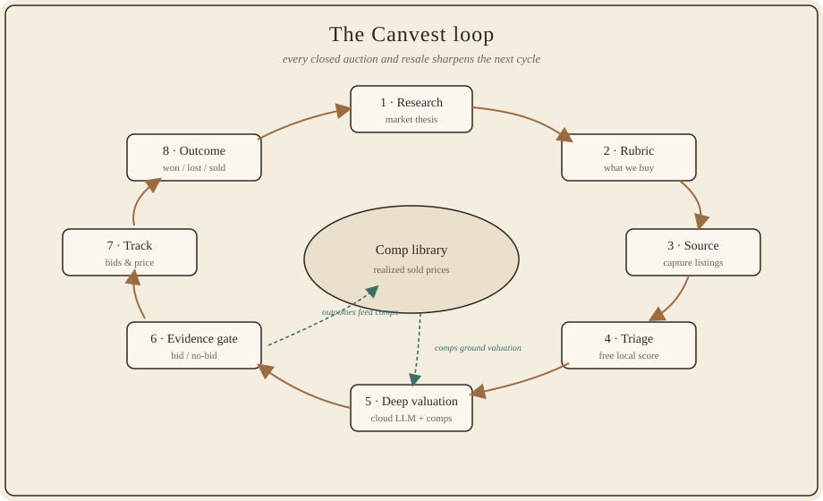
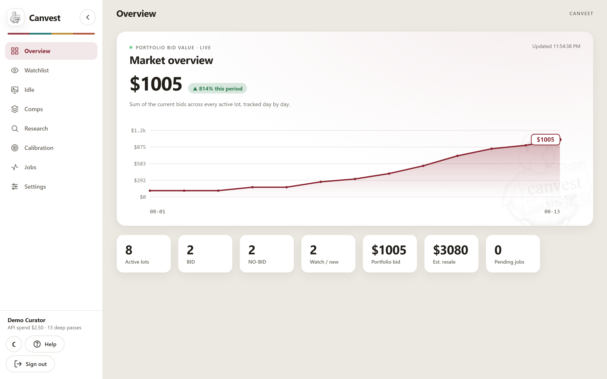
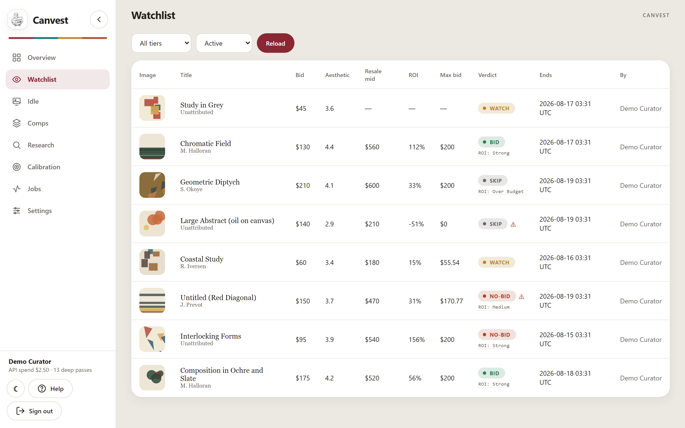
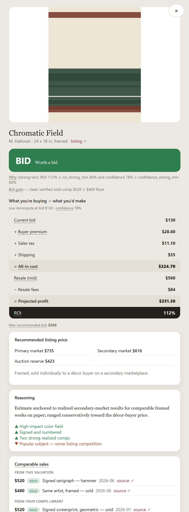
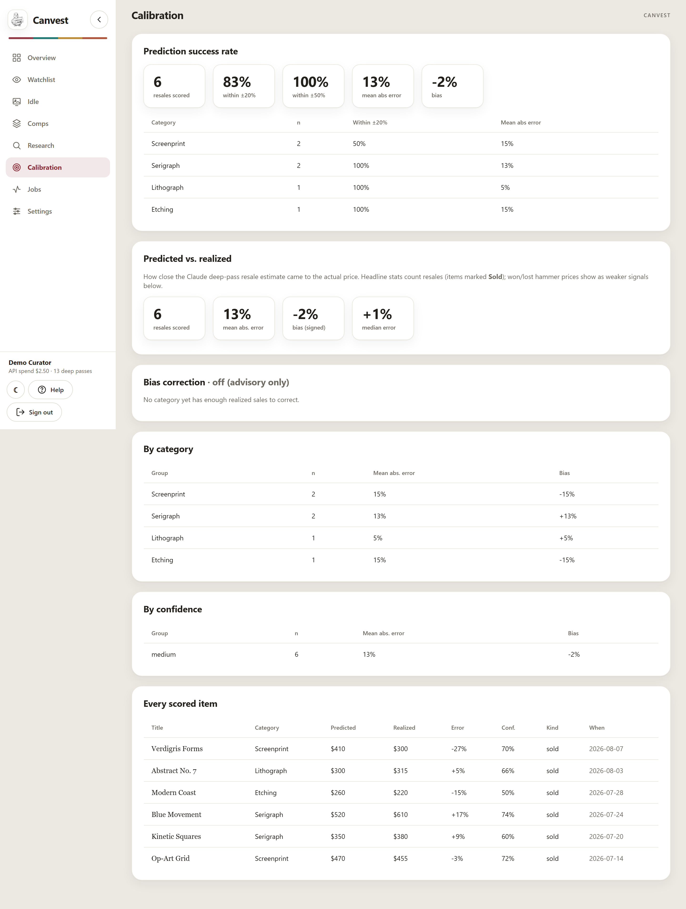
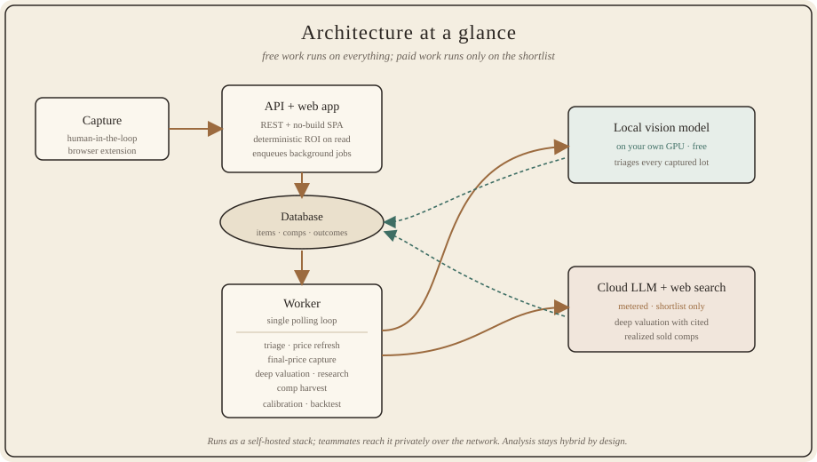

# Canvest

### Buy art on data, not taste.

Canvest is a self-hosted platform for **evidence-driven art investing** — sourcing
undervalued works at online art & estate auctions and reselling them for profit, with
every buy/skip decision backed by *real, realized sold prices* rather than gut feel.

*A portfolio and product showcase — this repository explains what Canvest does and how
I built it. It is **not** the full source code. Built by **Joseph Cintron**.*

**🌐 Live site: [josephcintron.github.io/canvest](https://josephcintron.github.io/canvest/)**

---

## About this project

I designed and built Canvest end to end — the research methodology, the data model, the
analysis pipeline, and the web application. At its core it's a **research loop**: form a
hypothesis about a market, operationalize it into a scoring rubric, collect data, then
**measure predicted outcomes against realized ones and calibrate**. I'm sharing it here
as a case study of how I approach an open-ended, quantitative problem.

> Core architecture and logic designed by me; Anthropic's Claude was used for
> boilerplate generation and rapid prototyping during development.

## What this project demonstrates

- **Methodology design** — turning a fuzzy goal ("flip art profitably") into a precise,
  testable, versioned procedure with explicit decision rules.
- **Model-assisted data analysis** — a two-tier pipeline pairing a **local vision model**
  (free, runs on everything) with a **metered cloud LLM** (structured, schema-strict
  valuations on the shortlist), so compute is spent proportional to signal.
- **Validation & calibration** — the part I care most about: comparing predicted resale
  to realized prices, reporting a success rate, and deriving per-category bias
  corrections as evidence accumulates. Backtesting the decision rule over realized
  outcomes.
- **Evidence discipline** — a hard gate that refuses a "buy" recommendation unless a
  *verified, realized* comparable supports it, so an optimistic estimate can't drive a
  purchase.
- **Reproducible engineering** — deterministic, unit-tested economics recomputed on
  every read; an additive, non-destructive data model; containerized, self-hosted
  deployment.
- **Clear communication** — this write-up, the methodology and architecture docs, and
  the diagrams below.

> Skills a research assistant role leans on: framing a question, building the data
> pipeline to answer it, and being honest about how well the answer holds up. That's the
> whole loop below.

## The problem

Auction art is priced on taste. A piece "looks like it should sell for a lot," so someone
bids — and then it sits, or resells for a fraction of the outlay once buyer's premium,
tax, shipping, and marketplace fees are counted. The people who profit aren't the ones
with the best eye; they're the ones with the best **evidence and discipline**. Canvest
turns that discipline into software.

## The approach

Canvest runs the whole operation as a **closed learning loop**. Each cycle feeds the
next: what actually sold becomes the evidence that sharpens the next valuation.

1. **Research** — build an evidence-backed thesis of what's appreciating and reselling in
   a given price band.
2. **Rubric** — translate the thesis into a versioned scoring rubric for what to buy.
3. **Source** — capture promising listings (human-in-the-loop, no bulk scraping).
4. **Triage** — score every captured lot automatically and for free on a local model.
5. **Deep valuation** — for the shortlist, a cloud model with web search estimates the
   framed resale price and cites **realized** sold comparables.
6. **Evidence gate** — recommend a bid *only* when a verified realized comp backs the
   number. Great ROI on paper with no real sold comp → **no-bid**.
7. **Track** — watch bids move, with live ROI recomputed on every view.
8. **Outcome** — record what was won, lost, and resold for.
9. **Calibrate** — measure predicted vs. realized, and let accuracy compound.

> The result of interest isn't any single flip — it's the **calibration curve**: does
> predicted resale track realized resale, and does that tracking improve over time?

## What it looks like

| Portfolio overview | Watchlist with live verdicts |
|---|---|
|  |  |

| Lot detail: cost → resale → verdict | Prediction calibration |
|---|---|
|  |  |

*Screenshots show a demo instance populated with synthetic data — no real listings,
artists, or prices.*

## How it's built

A compact, self-hosted stack — an API + no-build web app, a background worker, and a
database — with **hybrid analysis** at its heart: a free local vision model triages
everything, while a metered cloud model does the deep, comp-backed valuations.

**Stack:** Python · FastAPI · PostgreSQL (vector-ready) / SQLite in dev · a dependency-free
vanilla-JS SPA · a local vision model for triage · a hosted LLM with web search for deep
valuation · containerized for single-host self-hosting.

Read more:
- **[docs/methodology.md](docs/methodology.md)** — the loop stage by stage, an
  illustrative cost model, and the evidence gate.
- **[docs/architecture.md](docs/architecture.md)** — how the pieces fit together.
- **[snippets/](snippets/)** — a few short, *illustrative* code excerpts, simplified for
  review: the deterministic ROI/tier math, the rubric's shape (scored dimensions + veto
  gates), the schema-strict valuation contract, and the calibration statistics.
- **[examples/evidence-gate/](examples/evidence-gate/)** — a self-contained, runnable
  script (no dependencies, no model) that puts synthetic lots through the ROI math, the
  evidence gate, and the calibration pass.
- **[docs/faq.md](docs/faq.md)** — scope, data ethics, and access.

## ML methodology & evaluation

The ML in Canvest isn't a model bolted onto a CRUD app — it's a small set of deliberate
choices about how to make a language model's output *safe to act on with money*. Three
ideas do the work:

- **Structured output over a closed schema.** Deep valuation asks the cloud model for one
  fixed JSON shape — a resale range, confidence, positives/risks, and comparable sales
  each tagged *realized* vs *asking* with a cited source — and that response is validated
  before it can influence anything. Malformed fields, out-of-range values, or a comp with
  no source are rejected. The model *proposes* a valuation; deterministic code and the
  evidence gate *dispose*. A great number with no verified realized comp behind it becomes
  **NO-BID**, not a buy.
- **Cheap-first inference funnel.** Compute is spent proportional to signal. A **free
  local vision model** triages every captured lot; only what clears the bar reaches the
  **metered cloud valuation**. The expensive model never runs on the firehose — it runs on
  a shortlist the cheap pass already found plausible, so cost tracks quality, not volume.
- **Validation & calibration as the guardrail.** The output I trust least is the resale
  prediction, so it is measured, not assumed. Every lot that was both valued and later
  realized a price feeds a calibration pass: signed and absolute error, a **prediction
  success rate** (share of estimates within a tolerance of the real price), and an advisory
  **per-category bias correction** that is only trusted once a category has enough realized
  samples. The bid/no-bid gate always uses the raw, conservative estimate.

**The result of interest, honestly.** The point isn't any single flip — it's the
**calibration curve**: does predicted resale track realized resale, and does that tracking
improve as the comp library grows? A companion **backtest** replays the bid/no-bid rule
over realized outcomes to check the decision rule actually makes money, not just that the
estimator is unbiased. Two caveats belong up front rather than buried: the biggest driver
of quality is the coverage of the realized-comp library and the rubric it scores against —
a thin or overstated rubric will *flatter* the numbers, so that input is the first thing to
interrogate, not the last; and the figures in this public showcase come from a demo
instance on **synthetic data**, so they illustrate the method, not a track record.

→ Runnable, dependency-free demo of the gate and the calibration pass:
**[examples/evidence-gate/](examples/evidence-gate/)**.

## Scope of this repository

This is a **preview**, not the product. It contains documentation, diagrams, brand
assets, screenshots, and simplified illustrative excerpts. The tuned core — the rubric
dimensions and veto gates, the valuation prompts and schemas, the evidence-gate floors
and cost-model rates, and the sourcing specifics — is intentionally not published here.

## Licensing

**© 2026 Joseph Cintron. All rights reserved.**

This repository is a portfolio and product showcase. The screenshots, written material,
and illustrative code excerpts are provided **for review only**. They may not be copied,
redistributed, or used commercially, and no license to the Canvest source code is
granted. See **[LICENSE](LICENSE)**.

## About the author

**Joseph Cintron** — I build **ML/AI systems** with an emphasis on the unglamorous parts
that make them trustworthy: structured, schema-validated model output; cheap-first
pipelines that spend compute where it earns its keep; and honest measurement of
predictions against ground truth. Canvest is a case study in exactly that — framing an
open-ended quantitative question, building the data pipeline to answer it, and being candid
about how well the answer holds up. That loop — **question → pipeline → calibration** — is
the core of a data-science / ML research role, and the reason I'm pursuing one.

## Contact

Built by **Joseph Cintron**. For collaboration, research opportunities, licensing, or
early-access questions, reach out via the contact details on my GitHub profile.
